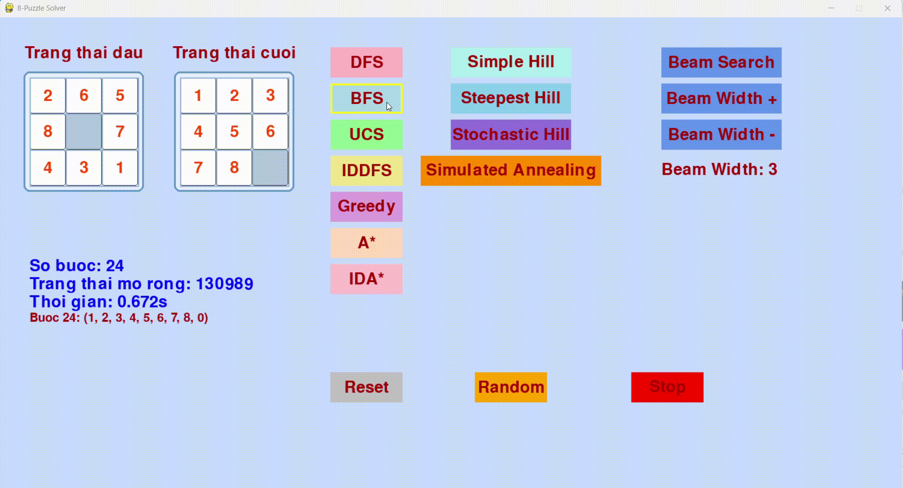
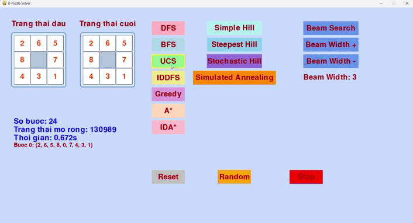
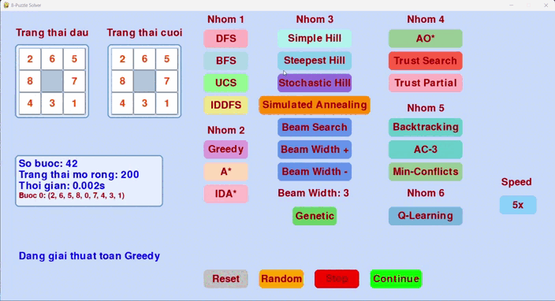
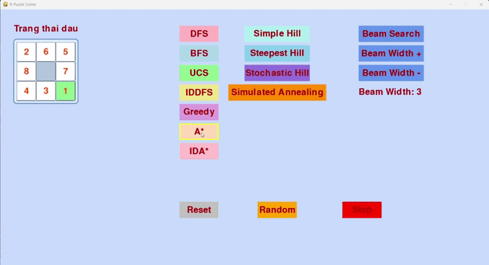
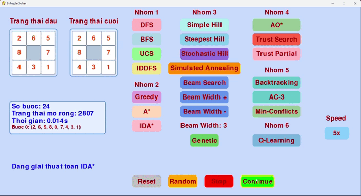
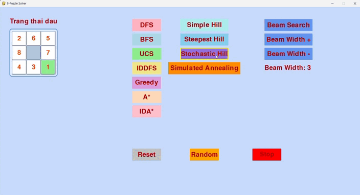

# AI_exercise

# Đồ án cá nhân: 8-Puzzle Solver

## 🎯 Mục tiêu
      Xây dựng một chương trình giải bài toán 8-Puzzle sử dụng nhiều thuật toán tìm kiếm trong lĩnh vực Trí tuệ nhân tạo (AI). Chương trình cung cấp giao diện đồ họa (GUI) trực quan để nhập trạng thái ban đầu, hiển thị quá trình giải và so sánh hiệu suất của các thuật toán. Các thuật toán được triển khai bao gồm tìm kiếm không có thông tin, tìm kiếm có thông tin, và các phương pháp tối ưu hóa cục bộ, cùng với một số thuật toán đặc biệt.
---

## 🧠 Các thuật toán được triển khai
Dưới đây là danh sách các thuật toán được triển khai trong chương trình, kèm theo mô tả chi tiết và minh họa (khi có sẵn). Mỗi thuật toán được thiết kế để tìm đường đi từ trạng thái ban đầu đến trạng thái mục tiêu (1, 2, 3, 4, 5, 6, 7, 8, 0).

| Thuật Toán               | Mô Tả                                                                 | Minh Họa GIF                              |
|--------------------------|----------------------------------------------------------------------|-------------------------------------------|
| **Breadth-First Search (BFS)** | Tìm kiếm theo chiều rộng, sử dụng hàng đợi (queue) để khám phá tất cả các trạng thái ở mức hiện tại trước khi chuyển sang mức sâu hơn. Đảm bảo tìm được đường đi ngắn nhất nhưng tốn bộ nhớ khi không gian trạng thái lớn.    |                      |
| **Depth-First Search (DFS)**   | Tìm kiếm theo chiều sâu, sử dụng ngăn xếp (stack) để khám phá nhánh sâu nhất trước khi quay lại. Không đảm bảo đường đi ngắn nhất và có thể dẫn đến vòng lặp nếu không kiểm soát.             |                    |
| **Uniform Cost Search (UCS)**  | Tìm kiếm chi phí đồng nhất, sử dụng hàng đợi ưu tiên (priority queue) để ưu tiên trạng thái có chi phí đường đi từ gốc thấp nhất. Đảm bảo đường đi tối ưu khi chi phí di chuyển giữa các trạng thái bằng nhau.        |                     |
| **Iterative Deepening DFS (IDDFS)** | Kết hợp ưu điểm của DFS và BFS, thực hiện DFS với giới hạn độ sâu tăng dần qua từng vòng lặp. Tiết kiệm bộ nhớ hơn BFS và đảm bảo đường đi ngắn nhất.            |                 |
| **Greedy Best-First Search**   | Tìm kiếm tham lam, sử dụng hàng đợi ưu tiên để chọn trạng thái có giá trị heuristic (khoảng cách Manhattan) nhỏ nhất mà không xét chi phí từ gốc. Nhanh nhưng không đảm bảo tối ưu.          |                |
| **A* Search**                 | Tìm kiếm tối ưu, kết hợp chi phí từ gốc (g) và giá trị heuristic (h = Manhattan + Linear Conflict). Đảm bảo đường đi ngắn nhất nếu heuristic thỏa mãn tính chất đơn điệu (monotonic).       |                 |
| **IDA* Search**               | Biến thể của A*, sử dụng tìm kiếm theo chiều sâu với ngưỡng heuristic tăng dần. Tiết kiệm bộ nhớ hơn A* nhưng có thể lặp lại việc khám phá trạng thái.               |                |
| **Simple Hill Climbing**       | Tìm kiếm leo đồi đơn giản, chọn trạng thái láng giềng ngẫu nhiên tốt hơn trạng thái hiện tại dựa trên heuristic (Manhattan + Linear Conflict). Dễ bị kẹt ở cực trị cục bộ.                    |     |
| **Steepest Hill Climbing**     | Tìm kiếm leo đồi dốc nhất, xem xét tất cả trạng thái láng giềng và chọn trạng thái có heuristic tốt nhất. Vẫn có nguy cơ kẹt ở cực trị cục bộ nhưng cải thiện hơn Simple Hill Climbing.    |  |
| **Stochastic Hill Climbing**   | Tìm kiếm leo đồi ngẫu nhiên, chọn trạng thái láng giềng ngẫu nhiên nhưng ưu tiên trạng thái tốt hơn dựa trên xác suất. Giúp thoát khỏi cực trị cục bộ nhờ yếu tố ngẫu nhiên.           |  |
| **Simulated Annealing**        | Mô phỏng ủ nhiệt, chấp nhận cả trạng thái xấu hơn với xác suất giảm dần theo "nhiệt độ". Nhiệt độ giảm theo thời gian (cooling rate), giúp thoát khỏi cực trị cục bộ và tìm giải pháp toàn cục.    |  |
| **Beam Search**                | Tìm kiếm chùm, giữ một số lượng trạng thái giới hạn (beam width) ở mỗi mức, kết hợp giữa BFS và tính tham lam. Có thể bỏ sót giải pháp tối ưu nếu beam width nhỏ.   |      |
| **Beam Search**                | Tìm kiếm chùm, giữ một số lượng trạng thái giới hạn (beam width) ở mỗi mức, kết hợp giữa BFS và tính tham lam. Có thể bỏ sót giải pháp tối ưu nếu beam width nhỏ.   |      |
| **Genetic Algorithm**                | Thuật toán di truyền, sử dụng quần thể các trạng thái, thực hiện các phép lai ghép (crossover) và đột biến (mutation) để tiến hóa đến trạng thái mục tiêu. Phù hợp với không gian trạng thái phức tạp.   |     |
| **AO Search***                | Tìm kiếm AND-OR, xây dựng kế hoạch dựa trên các hành động và kết quả có thể xảy ra. Phù hợp với các bài toán có tính không chắc chắn, sử dụng heuristic để định hướng.   |      |
| **Trust-Based Search**                | Tìm kiếm dựa trên niềm tin, kết hợp heuristic với yếu tố niềm tin (belief factor) dựa trên lịch sử trạng thái. Tăng khả năng ưu tiên các trạng thái gần giải pháp.   |      |
| **Trust-Based Search (Partial)**                | Biến thể của Trust-Based Search, giả định chỉ biết một phần thông tin mục tiêu (ví dụ: hàng đầu tiên). Sử dụng niềm tin và heuristic để định hướng, chuyển sang A* khi đạt mục tiêu cục bộ.   |      |
| **Backtracking CSP**                | Tìm kiếm quay lui dựa trên bài toán thỏa mãn ràng buộc (CSP), gán giá trị cho các ô trên bảng và kiểm tra tính hợp lệ (độ khả thi và khả năng đạt từ trạng thái ban đầu).   |     |

## 📝 Chi tiết bổ sung về các thuật toán

.  Breadth-First Search (BFS):
   
    •	Ưu điểm: Đảm bảo tìm được đường đi ngắn nhất trong không gian trạng thái không trọng số.
    
    •	Nhược điểm: Tốn nhiều bộ nhớ do lưu trữ tất cả trạng thái ở mỗi mức.
    
    •	Heuristic: Không sử dụng.
    
    •	Ứng dụng: Phù hợp với các bài toán đơn giản, không gian trạng thái nhỏ.
    
.  Depth-First Search (DFS):
   
    •	Ưu điểm: Tiết kiệm bộ nhớ, chỉ lưu trữ đường đi hiện tại.
    
    •	Nhược điểm: Có thể đi vào nhánh vô hạn hoặc không tìm được đường đi ngắn nhất.
    
    •	Heuristic: Không sử dụng.
    
    •	Ứng dụng: Hữu ích khi không gian trạng thái lớn nhưng cần kiểm soát vòng lặp.

.  Uniform Cost Search (UCS):
   
    •	Ưu điểm: Tìm được đường đi tối ưu khi chi phí di chuyển đồng nhất.
    
    •	Nhược điểm: Tốn bộ nhớ tương tự BFS.
    
    •	Heuristic: Không sử dụng, chỉ dựa trên chi phí thực tế.
    
    •	Ứng dụng: Phù hợp khi chi phí giữa các trạng thái khác nhau.
    
.  Iterative Deepening DFS (IDDFS): 

    •	Ưu điểm: Kết hợp ưu điểm của BFS (đường đi ngắn nhất) và DFS (tiết kiệm bộ nhớ).
    
    •	Nhược điểm: Lặp lại việc khám phá trạng thái, dẫn đến thời gian chạy lâu hơn BFS.
    
    •	Heuristic: Không sử dụng.
    
    •	Ứng dụng: Lý tưởng khi cần giải pháp tối ưu với bộ nhớ hạn chế.
    
.  Greedy Best-First Search:
    
    •	Ưu điểm: Nhanh do chỉ dựa vào heuristic, giảm số lượng trạng thái cần khám phá.
    
    •	Nhược điểm: Không đảm bảo đường đi tối ưu, có thể bỏ qua giải pháp tốt.
    
    •	Heuristic: Khoảng cách Manhattan.
    
    •	Ứng dụng: Phù hợp khi cần giải pháp nhanh nhưng không yêu cầu tối ưu.
    
.  A Search*:
    
    •	Ưu điểm: Tìm đường đi ngắn nhất nếu heuristic thỏa mãn tính chất đơn điệu.
    
    •	Nhược điểm: Tốn bộ nhớ để lưu trữ các trạng thái trong hàng đợi ưu tiên.
    
    •	Heuristic: Kết hợp khoảng cách Manhattan và Linear Conflict để cải thiện độ chính xác.
    
    •	Ứng dụng: Lý tưởng cho các bài toán yêu cầu giải pháp tối ưu.
    
.  IDA Search*:

    •	Ưu điểm: Tiết kiệm bộ nhớ hơn A* do sử dụng tìm kiếm theo chiều sâu.

    •	Nhược điểm: Có thể lặp lại việc khám phá trạng thái, dẫn đến thời gian chạy lâu.
    
    •	Heuristic: Tương tự A* (Manhattan + Linear Conflict).
    
    •	Ứng dụng: Phù hợp khi bộ nhớ hạn chế nhưng vẫn cần giải pháp tối ưu.
    
.  Simple Hill Climbing:
     
    •	Ưu điểm: Đơn giản, nhanh khi không gian trạng thái có ít cực trị cục bộ.

    •	Nhược điểm: Dễ bị kẹt ở cực trị cục bộ, bỏ qua giải pháp toàn cục.
    
    •	Heuristic: Manhattan + Linear Conflict.
    
    •	Ứng dụng: Hữu ích cho các bài toán cần giải pháp gần tối ưu nhanh chóng.
    
.  Steepest-Ascent Hill Climbing:
    
    •	Ưu điểm: Cải thiện Simple Hill Climbing bằng cách chọn trạng thái láng giềng tốt nhất.

    •	Nhược điểm: Vẫn có thể kẹt ở cực trị cục bộ.
    
    •	Heuristic: Manhattan + Linear Conflict.
    
    •	Ứng dụng: Phù hợp khi cần cải thiện chất lượng giải pháp so với Simple Hill Climbing.
    
.  Stochastic Hill Climbing:
  
    •	Ưu điểm: Yếu tố ngẫu nhiên giúp thoát khỏi cực trị cục bộ.

    •	Nhược điểm: Không đảm bảo tìm được giải pháp tối ưu.
    
    •	Heuristic: Manhattan + Linear Conflict, kết hợp xác suất chọn trạng thái.
    
    •	Ứng dụng: Hữu ích trong không gian trạng thái phức tạp với nhiều cực trị cục bộ.
    
.  Simulated Annealing:

    •	Ưu điểm: Thoát khỏi cực trị cục bộ nhờ chấp nhận trạng thái xấu hơn với xác suất giảm dần.
    
    •	Nhược điểm: Phụ thuộc vào tham số nhiệt độ và tốc độ làm nguội.
    
    •	Heuristic: Manhattan + Linear Conflict.
    
    •	Ứng dụng: Phù hợp khi cần tìm giải pháp toàn cục trong không gian phức tạp.
    
.  Beam Search:
    
    •	Ưu điểm: Giảm bộ nhớ và thời gian bằng cách giới hạn số trạng thái ở mỗi mức.
    
    •	Nhược điểm: Có thể bỏ sót giải pháp tối ưu nếu beam width quá nhỏ.
    
    •	Heuristic: Manhattan + Linear Conflict.
    
    •	Ứng dụng: Hữu ích khi cần cân bằng giữa tốc độ và chất lượng giải pháp.
    
.  Genetic Algorithm:

    •	Ưu điểm: Khám phá không gian trạng thái lớn thông qua tiến hóa quần thể.
    
    •	Nhược điểm: Phụ thuộc vào các tham số như tỷ lệ lai ghép, đột biến và kích thước quần thể.
    
    •	Heuristic: Manhattan + Linear Conflict để đánh giá độ thích nghi (fitness).
    
    •	Ứng dụng: Phù hợp với bài toán tối ưu hóa phức tạp.
    
.  AO Search*:
    
    •	Ưu điểm: Xử lý bài toán với các hành động có kết quả không chắc chắn bằng cách xây dựng kế hoạch AND-OR.
    
    •	Nhược điểm: Phức tạp hơn các thuật toán tìm kiếm thông thường.
    
    •	Heuristic: Manhattan + Linear Conflict.
    
    •	Ứng dụng: Hữu ích trong các bài toán có cấu trúc kế hoạch.
    
.  Trust-Based Search:
    
    •	Ưu điểm: Tăng cường tìm kiếm bằng cách sử dụng niềm tin dựa trên lịch sử trạng thái, ưu tiên các trạng thái gần giải pháp.
    
    •	Nhược điểm: Hiệu quả phụ thuộc vào cách tính niềm tin.
    
    •	Heuristic: Manhattan + Linear Conflict, kết hợp yếu tố niềm tin.
    
    •	Ứng dụng: Phù hợp khi cần cải thiện hiệu quả tìm kiếm heuristic.
    
.  Trust-Based Search (Partial):
    
    •	Ưu điểm: Xử lý bài toán với thông tin mục tiêu không đầy đủ, chuyển sang A* khi đạt mục tiêu cục bộ.
    
    •	Nhược điểm: Phụ thuộc vào chất lượng thông tin cục bộ.
    
    •	Heuristic: Manhattan + Linear Conflict, kết hợp niềm tin dựa trên trạng thái đã thăm.
    
    •	Ứng dụng: Hữu ích trong các bài toán có thông tin mục tiêu hạn chế.
    
.  Backtracking CSP:
    
    •	Ưu điểm: Tìm kiếm giải pháp bằng cách gán giá trị cho các ô và kiểm tra ràng buộc, đảm bảo tính khả thi.
    
    •	Nhược điểm: Có thể tốn thời gian nếu không gian trạng thái lớn.
    
    •	Heuristic: Không sử dụng trực tiếp, dựa trên giá trị mục tiêu và kiểm tra tính khả thi.
    
    •	Ứng dụng: Phù hợp với bài toán CSP hoặc khi cần đảm bảo tính hợp lệ của trạng thái.

## 🌟 Các tính năng của chương trình
Giao diện đồ họa (GUI): Sử dụng thư viện pygame để tạo giao diện trực quan, cho phép người dùng: 

      •	Nhập trạng thái ban đầu bằng cách chọn ô và nhập số (0-8).
      
      •	Tạo trạng thái ban đầu ngẫu nhiên (đảm bảo khả thi).
      
      •	Chọn thuật toán để giải và theo dõi quá trình giải từng bước.
      
      •	Điều chỉnh tốc độ hiển thị bước giải (1x, 2x, 5x, 10x).
      
      •	Tăng/giảm độ rộng chùm (beam width) cho Beam Search.
      
      •	Hiển thị số bước, số trạng thái mở rộng, và thời gian thực thi.
      
•  Kiểm tra tính khả thi: Hàm is_solvable kiểm tra trạng thái ban đầu có thể đạt được trạng thái mục tiêu hay không dựa trên số lần đảo ngược (inversions).

•  Heuristic cải tiến: 

      •	Khoảng cách Manhattan: Tính tổng khoảng cách các ô từ vị trí hiện tại đến vị trí mục tiêu.
      
      •	Linear Conflict: Bổ sung chi phí khi hai ô trong cùng hàng/cột cần hoán đổi vị trí, cải thiện độ chính xác của heuristic.
      
•  Hỗ trợ nhiều thuật toán: Cho phép so sánh hiệu suất giữa các thuật toán dựa trên số bước, số trạng thái mở rộng, và thời gian chạy. 

•  Xử lý lỗi: Hiển thị thông báo khi trạng thái ban đầu không khả thi hoặc thuật toán không tìm được giải pháp.

## 🔍 Kết luận
Chương trình cung cấp một nền tảng toàn diện để nghiên cứu và so sánh các thuật toán AI trong bài toán 8-Puzzle. Giao diện trực quan và hỗ trợ nhiều thuật toán giúp người dùng dễ dàng thử nghiệm và học hỏi về cách các thuật toán hoạt động. Các thuật toán như A*, IDA*, và Simulated Annealing nổi bật về hiệu suất và khả năng xử lý các trạng thái phức tạp, trong khi các phương pháp như Trust-Based Search và Backtracking CSP mang lại góc nhìn mới về cách tiếp cận bài toán.

## 👨‍💻 Tác giả

**Nguyễn Trung Hậu**  
MSSV: `23110212`  
Môn: `Trí Tuệ Nhân Tạo`  
Giáo viên hướng dẫn: `Phan Thị Huyền Trang` 
