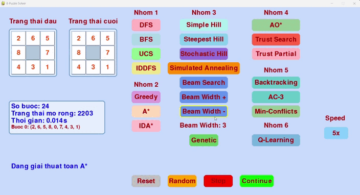
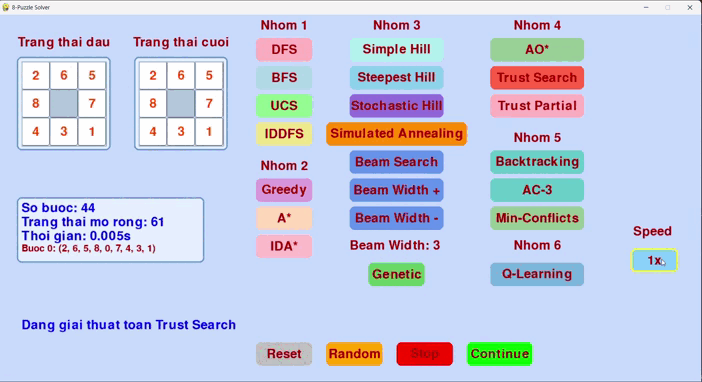
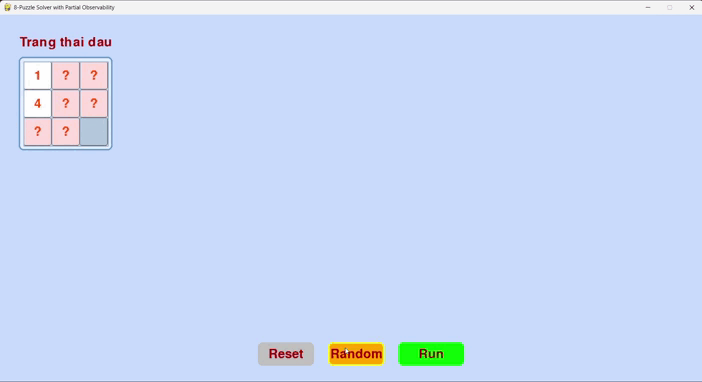
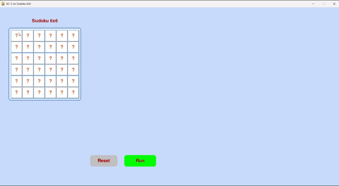
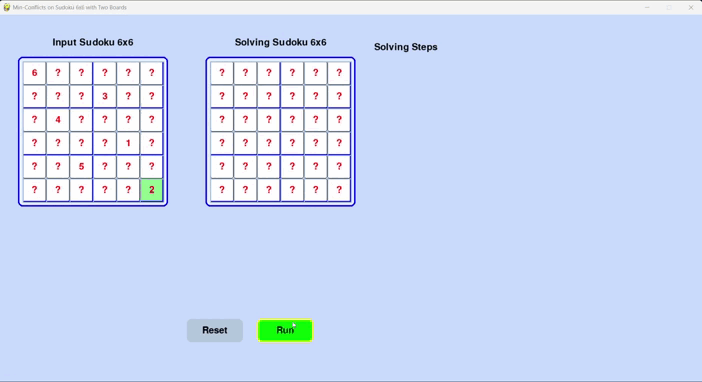
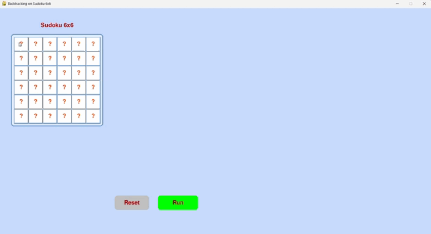
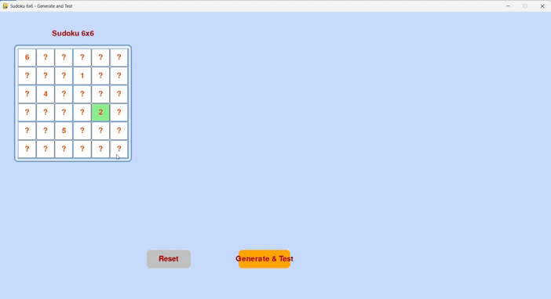

# AI_exercise

# Đồ án cá nhân: 8-Puzzle Solver

## 🎯 Mục tiêu
      
   Xây dựng một chương trình giải bài toán 8-Puzzle sử dụng nhiều thuật toán tìm kiếm trong lĩnh vực Trí tuệ nhân tạo (AI). Chương trình cung cấp giao diện đồ họa (GUI) trực quan để nhập trạng thái ban đầu, hiển thị quá trình giải và so sánh hiệu suất của các thuật toán. Các thuật toán được triển khai bao gồm tìm kiếm không có thông tin, tìm kiếm có thông tin, tìm kiếm ràng buộc, tìm kiếm cục bộ, tìm kiếm trong môi trường không xác định, cùng với một số thuật toán đặc biệt (Q-learning).
     
---

## 🧠 Nội dung
### 📝✏️ Các thành phần của bài toán 8-Puzzle
- **State space**: Tập hợp các hoán vị của 9 ô 
- **Actions**: Di chuyển ô trống (lên, xuống, trái, phải).
- **Transition model**: Hoán đổi ô trống với ô lân cận, tạo trạng thái mới.
- **Goal test**: Trạng thái bằng `(1, 2, 3, 4, 5, 6, 7, 8, 0)`.
- **Path cost**: Mỗi bước di chuyển có chi phí 1.
- **Solution**: Đường đi từ trạng thái ban đầu đến trạng thái mục tiêu, biểu diễn bằng danh sách các trạng thái.
- **Heuristic** : Khoảng cách Manhattan + Linear Conflict để ước lượng chi phí .
  
### 2.1. Các thuật toán tìm kiếm không có thông tin
#### Thuật toán và mô tả

| Thuật Toán               | Mô Tả                                                                 | Minh Họa GIF                              |
|--------------------------|----------------------------------------------------------------------|-------------------------------------------|
| **Breadth-First Search (BFS)** | Tìm kiếm theo chiều rộng, sử dụng hàng đợi (queue) để khám phá tất cả các trạng thái ở mức hiện tại trước khi chuyển sang mức sâu hơn. Đảm bảo tìm được đường đi ngắn nhất nhưng tốn bộ nhớ khi không gian trạng thái lớn.    |                      |
| **Depth-First Search (DFS)**   | Tìm kiếm theo chiều sâu, sử dụng ngăn xếp (stack) để khám phá nhánh sâu nhất trước khi quay lại. Không đảm bảo đường đi ngắn nhất và có thể dẫn đến vòng lặp nếu không kiểm soát.             |                      |
| **Uniform Cost Search (UCS)**  | Tìm kiếm chi phí đồng nhất, sử dụng hàng đợi ưu tiên (priority queue) để ưu tiên trạng thái có chi phí đường đi từ gốc thấp nhất. Đảm bảo đường đi tối ưu khi chi phí di chuyển giữa các trạng thái bằng nhau.        |                     |
| **Iterative Deepening DFS (IDDFS)** | Kết hợp ưu điểm của DFS và BFS, thực hiện DFS với giới hạn độ sâu tăng dần qua từng vòng lặp. Tiết kiệm bộ nhớ hơn BFS và đảm bảo đường đi ngắn nhất.            |                 |

#### So sánh hiệu suất và nhận xét
1.	  DFS (Depth-First Search):
	  
•	Ưu điểm: Tiết kiệm bộ nhớ nhờ chỉ khám phá một nhánh tại một thời điểm  và có thời gian thực thi nhanh .

•	Nhược điểm: Không đảm bảo đường đi ngắn nhất , dễ bị kẹt trong nhánh sâu hoặc vòng lặp nếu không kiểm soát độ sâu.

2.	 BFS (Breadth-First Search):

•	Ưu điểm: Đảm bảo đường đi ngắn nhất, phù hợp với bài toán cần giải pháp tối ưu về số bước.

•	Nhược điểm: Tốn nhiều bộ nhớ do mở rộng trạng thái và thời gian thực thi hơi cao .

3.	  UCS (Uniform Cost Search):
 
•	Ưu điểm: Đảm bảo đường đi ngắn nhất  và tối ưu về chi phí khi chi phí di chuyển bằng nhau.

•	Nhược điểm: Mở rộng nhiều trạng thái hơn BFS và thời gian thực thi cao hơn do quản lý hàng đợi ưu tiên.

4.	  IDDFS (Iterative Deepening Depth-First Search):
	 
•	Ưu điểm: Đảm bảo đường đi ngắn nhất và kết hợp ưu điểm của BFS với DFS .

•	Nhược điểm: Mở rộng rất nhiều trạng thái  và thời gian thực thi dài do lặp lại tìm kiếm với các giới hạn độ sâu.

#### Nhận xét

•      Hiệu suất tối ưu về số bước: BFS, UCS, và IDDFS đều tìm được đường đi ngắn nhất , trong khi DFS với đường đi rất dài . 

•      Hiệu suất về bộ nhớ và tốc độ: DFS là lựa chọn tốt nhất khi bộ nhớ hạn chế và thời gian thực thi quan trọng . BFS và UCS cân bằng giữa số bước tối ưu và thời gian thực thi hợp lý, nhưng UCS mở rộng nhiều trạng thái hơn một chút. IDDFS, mặc dù đảm bảo giải pháp tối ưu, lại tiêu tốn nhiều tài nguyên nhất .

### 2.2. Các thuật toán tìm kiếm có thông tin
#### Thuật toán và mô tả

| Thuật Toán               | Mô Tả                                                                 | Minh Họa GIF                              |
|--------------------------|----------------------------------------------------------------------|-------------------------------------------|
| **Greedy Search**   | Tìm kiếm tham lam, sử dụng hàng đợi ưu tiên để chọn trạng thái có giá trị heuristic (khoảng cách Manhattan) nhỏ nhất mà không xét chi phí từ gốc. Nhanh nhưng không đảm bảo tối ưu.          |                |
| **A* Search**                 | Tìm kiếm tối ưu, kết hợp chi phí từ gốc (g) và giá trị heuristic (h = Manhattan + Linear Conflict). Đảm bảo đường đi ngắn nhất nếu heuristic thỏa mãn tính chất đơn điệu (monotonic).       |                 |
| **IDA* Search**               | Biến thể của A*, sử dụng tìm kiếm theo chiều sâu với ngưỡng heuristic tăng dần. Tiết kiệm bộ nhớ hơn A* nhưng có thể lặp lại việc khám phá trạng thái.               |                |

#### So sánh hiệu suất và nhận xét
1.	Greedy Best-First Search:
	
•	Ưu điểm: Rất nhanh và mở rộng ít trạng thái nhất , nhờ chỉ tập trung vào trạng thái có giá trị heuristic thấp nhất tại mỗi bước.

•	Nhược điểm: Không đảm bảo tính tối ưu trong mọi tình huống, vì chỉ dựa vào heuristic (h) mà không tính chi phí đường đi (g). 

2.	A Search*:
   
•	Ưu điểm: Đảm bảo đường đi tối ưu nhờ kết hợp chi phí đường đi (g) và heuristic (h). Heuristic đơn điệu (Manhattan + Linear Conflict) giúp A* định hướng tốt.

•	Nhược điểm: Tốn nhiều bộ nhớ và thời gian hơn do phải quản lý hàng đợi ưu tiên và mở rộng nhiều trạng thái để đảm bảo tính tối ưu.

3.	IDA Search*:
   
•	Ưu điểm: Đảm bảo đường đi tối ưu với số trạng thái mở rộng thấp hơn A* và thời gian nhanh. IDA* tiết kiệm bộ nhớ bằng cách sử dụng chiến lược lặp sâu với ngưỡng chi phí.

•	Nhược điểm: Có thể lặp lại việc khám phá một số trạng thái, làm tăng chi phí tính toán trong các trường hợp phức tạp hơn.

#### Nhận xét

•      Hiệu suất tối ưu về số bước: Cả Greedy, A*, và IDA* đều tìm được đường đi tối ưu trong trường hợp này. Tuy nhiên, A* và IDA* đảm bảo tính tối ưu trong mọi trường hợp nhờ sử dụng f = g + h, trong khi Greedy chỉ đạt được nhờ heuristic hiệu quả. 

•      Hiệu suất về bộ nhớ và tốc độ: 

	•	Greedy vượt trội về tốc độ và số trạng thái mở rộng, nhưng không đáng tin cậy về tính tối ưu trong các trường hợp phức tạp.
	•	IDA* cân bằng tốt giữa tốc độ, số trạng thái mở rộng, và tính tối ưu, là lựa chọn hiệu quả khi bộ nhớ hạn chế.
	•	A* tốn nhiều tài nguyên hơn nhưng đảm bảo giải pháp tối ưu, phù hợp khi tài nguyên không bị giới hạn.

### 2.3. Các thuật toán tìm kiếm cục bộ
#### Thuật toán và mô tả
| Thuật Toán               | Mô Tả                                                                 | Minh Họa GIF                              |
|--------------------------|----------------------------------------------------------------------|-------------------------------------------|
| **Simple Hill Climbing**       | Tìm kiếm leo đồi đơn giản, chọn trạng thái láng giềng ngẫu nhiên tốt hơn trạng thái hiện tại dựa trên heuristic (Manhattan + Linear Conflict). Dễ bị kẹt ở cực trị cục bộ.                    |     |
| **Steepest Hill Climbing**     | Tìm kiếm leo đồi dốc nhất, xem xét tất cả trạng thái láng giềng và chọn trạng thái có heuristic tốt nhất. Vẫn có nguy cơ kẹt ở cực trị cục bộ nhưng cải thiện hơn Simple Hill Climbing.    |  |
| **Stochastic Hill Climbing**   | Tìm kiếm leo đồi ngẫu nhiên, chọn trạng thái láng giềng ngẫu nhiên nhưng ưu tiên trạng thái tốt hơn dựa trên xác suất. Giúp thoát khỏi cực trị cục bộ nhờ yếu tố ngẫu nhiên.           |  |
| **Simulated Annealing**        | Mô phỏng ủ nhiệt, chấp nhận cả trạng thái xấu hơn với xác suất giảm dần theo "nhiệt độ". Nhiệt độ giảm theo thời gian (cooling rate), giúp thoát khỏi cực trị cục bộ và tìm giải pháp toàn cục.    |    |
| **Beam Search**                | Tìm kiếm chùm, giữ một số lượng trạng thái giới hạn (beam width) ở mỗi mức, kết hợp giữa BFS và tính tham lam. Có thể bỏ sót giải pháp tối ưu nếu beam width nhỏ.   |      |
| **Genetic Algorithm**                | Thuật toán di truyền, sử dụng quần thể các trạng thái, thực hiện các phép lai ghép (crossover) và đột biến (mutation) để tiến hóa đến trạng thái mục tiêu. Phù hợp với không gian trạng thái phức tạp.   |      |

#### So sánh hiệu suất 
1.	Simple Hill Climbing: 

•	Ưu điểm: Rất nhanh và mở rộng ít trạng thái  nhờ chiến lược đơn giản.

•	Nhược điểm: Dễ bị kẹt ở cực trị cục bộ, không tìm thấy giải pháp trong nhiều trường hợp.

2.	Steepest Ascent Hill Climbing: 

•	Ưu điểm: Nhanh và mở rộng ít , tìm được giải pháp nhờ chọn trạng thái tốt nhất.

•	Nhược điểm: Giải pháp không tối ưu và vẫn có nguy cơ kẹt ở cực trị.

3.	Stochastic Hill Climbing: 

•	Ưu điểm: Tìm được giải pháp  nhờ yếu tố ngẫu nhiên giúp thoát cực trị cục bộ.

•	Nhược điểm: Số bước và thời gian dài, không hiệu quả về tối ưu.

4.	Simulated Annealing: 

•	Ưu điểm: Tìm được giải pháp với thời gian hợp lý , khả năng thoát cực trị nhờ cơ chế làm nguội.

•	Nhược điểm: Giải pháp dài và mở rộng nhiều hơn Steepest Ascent.

5.	Beam Search: 

•	Ưu điểm: Tìm được giải pháp với beam width tùy chọn , duy trì khám phá đa dạng.

•	Nhược điểm: Không tối ưu.

6.	Genetic Algorithm: 

•	Ưu điểm: Khả năng khám phá không gian lớn , lý tưởng cho bài toán phức tạp.

•	Nhược điểm: Không tìm thấy giải pháp trong giới hạn ít thế hệ, tốn nhiều thời gian .

#### Nhận xét

•      Hiệu suất về giải pháp: Chỉ Steepest Ascent Hill Climbing, Stochastic Hill Climbing, Simulated Annealing, và Beam Search tìm được giải pháp. Simple Hill Climbing và Genetic Algorithm thất bại trong nhiều trường hợp, phản ánh hạn chế của tìm kiếm cục bộ. 

•      Hiệu suất về bộ nhớ và tốc độ: 

	•	Simple Hill Climbing và Steepest Ascent Hill Climbing tiết kiệm tài nguyên nhất , nhưng không ổn định.
	•	Simulated Annealing cân bằng tốt giữa thời gian và số lần mở rộng .
	•	Beam Search và Genetic Algorithm tốn nhiều tài nguyên nhất, nhưng chỉ Beam Search thành công.

### 2.4. Các thuật toán tìm kiếm trong môi trường không xác định
#### Thuật toán và mô tả

| Thuật Toán               | Mô Tả                                                                 | Minh Họa GIF                              |
|--------------------------|----------------------------------------------------------------------|-------------------------------------------|
| **AO Search***                | Được thiết kế để xử lý các bài toán tìm kiếm trong môi trường không xác định (non-deterministic), nơi mỗi hành động có thể dẫn đến nhiều kết quả khác nhau.   |       |
| **Trust-Based Search**                | Thuật toán này hoạt động trong môi trường không có quan sát (non-observable), dựa trên niềm tin (belief state) và sử dụng yếu tố tin cậy (trust) để định hướng tìm kiếm.   |       |
| **Trust-Based Search (Partial)**                | Thuật toán này xử lý bài toán với quan sát từng phần (partial observability), sử dụng belief state và cập nhật dựa trên các quan sát (percepts).   |       |

#### So sánh hiệu suất 
1.	AND-OR Search: 

•	Ưu điểm: Xử lý tốt môi trường không xác định, xây dựng kế hoạch điều kiện khả thi cho mọi trường hợp. 

•	Nhược điểm: Khó tìm ra đường đi thành công

2.	Trust No Observation: 

•	Ưu điểm: Hiệu quả về mặt mở rộng trạng thái nhờ không phải xử lý quan sát. Yếu tố tin cậy giúp định hướng tìm kiếm.

•	Nhược điểm: Đường đi dài do thiếu thông tin, không đảm bảo tối ưu. Belief state có thể lớn nếu không có cách thu hẹp.

3.	Trust Partial Observation: 

•	Ưu điểm: Tận dụng quan sát để thu hẹp belief state, dẫn đến đường đi ngắn hơn . Kế hoạch điều kiện đảm bảo tính khả thi, phù hợp với thông tin hạn ché.

•	Nhược điểm: Số trạng thái mở rộng lớn  và thời gian chậm do chi phí tính toán belief state và cập nhật từ quan sát.

📝✏️ Tóm tắt các thành phần của bài toán Sudoku 6x6

• State space: Tập hợp các gán giá trị 1-6 cho 36 ô, thỏa mãn ràng buộc Alldiff (hàng, cột, vùng 2x3), ước lượng 10⁶-10⁸ trạng thái khả thi.

• Actions: Gán giá trị 1-6 cho ô trống, tuân theo ràng buộc không trùng lặp.

• Transition model: Cập nhật trạng thái bằng cách gán giá trị, kiểm tra tính hợp lệ, từ chối nếu có xung đột.

• Goal test: Bảng 6x6 hoàn chỉnh, mỗi hàng, cột, vùng 2x3 chứa duy nhất 1-6.

• Path cost: Mỗi gán giá trị hợp lệ có chi phí 1, tổng bằng số ô trống.

• Solution: Đường đi từ trạng thái ban đầu đến bảng hoàn chỉnh, biểu diễn bằng các bước gán giá trị.

• Heuristic: MRV (ưu tiên ô ít giá trị), LCV (giá trị ít ràng buộc), AC-3 (tính nhất quán cung).

### 2.5. Các thuật toán tìm kiếm có ràng buộc
#### Thuật toán và mô tả

| Thuật Toán               | Mô Tả                                                                 | Minh Họa GIF                              |
|--------------------------|----------------------------------------------------------------------|-------------------------------------------|
| **AC-3**                |Là thuật toán đảm bảo tính nhất quán cung (arc consistency) trong bài toán CSP. Nó xử lý từng cung (arc) trong danh sách các ràng buộc bằng cách loại bỏ các giá trị không thể thỏa mãn từ miền giá trị (domains) của các biến. Thuật toán sử dụng một hàng đợi (queue) để xử lý các cung và lặp lại cho đến khi không còn cung nào cần sửa đổi hoặc phát hiện không có giải pháp nào.   |        |
| **Min-Conflicts**                | Là thuật toán tìm kiếm cục bộ dựa trên việc giảm thiểu xung đột (conflicts) trong bài toán CSP. Nó bắt đầu với một trạng thái ngẫu nhiên hoặc nhập liệu và lặp lại các bước thay đổi giá trị của các biến có xung đột để đạt được trạng thái không xung đột. Thuật toán chọn ngẫu nhiên một biến có xung đột và gán giá trị làm giảm số xung đột tối đa.   |        |
| **Backtracking CSP**                | Kết hợp với AC-3 để giải bài toán CSP. Backtracking khám phá không gian trạng thái theo cách đệ quy, gán giá trị cho các biến và quay lui khi phát hiện xung đột. AC-3 được sử dụng như một bước tiền xử lý để giảm miền giá trị, và trong quá trình tìm kiếm, nó thực hiện suy luận để cập nhật miền.   |        |
| **Generate And Test CSP**                | Là một thuật toán đơn giản để giải bài toán CSP bằng cách sinh ngẫu nhiên hoặc có hệ thống các khả năng  cho toàn bộ bài toán và kiểm tra từng khả năng đó có thỏa mãn tất cả các ràng buộc hay không. Thuật toán bắt đầu với một trạng thái ban đầu (thường là trống hoặc ngẫu nhiên), sau đó thử gán giá trị cho từng biến theo một thứ tự xác định (thường từ trái sang phải, trên xuống dưới). Mỗi lần gán, nó kiểm tra tính nhất quán với các ràng buộc (như không trùng lặp trong hàng, cột, hoặc vùng). Nếu khả năng không thỏa mãn, thuật toán quay lui hoặc sinh khả năng mới. Quá trình tiếp tục cho đến khi tìm được một giải pháp hợp lệ hoặc xác định không có giải pháp nào.   |        |

#### So sánh hiệu suất 
1.	AC-3: 

•	Ưu điểm: Rất nhanh hiệu quả trong việc giảm miền giá trị, giúp cải thiện hiệu suất của các thuật toán tìm kiếm sau đó. Mở rộng ít trạng thái.

•	Nhược điểm: Không tìm được giải pháp hoàn chỉnh, chỉ là bước tiền xử lý.

2.	Min-Conflicts: 

•	Ưu điểm: Tìm giải pháp nhanh  với ít trạng thái mở rộng nếu khởi tạo tốt. 

•	Nhược điểm: Không đảm bảo tìm được giải pháp tối ưu, phụ thuộc vào ngẫu nhiên. Có thể thất bại nếu không gian trạng thái phức tạp.

3.	Backtracking: 

•	Ưu điểm: Đảm bảo tìm được giải pháp tối ưu nhờ heuristic, kết hợp AC-3 để giảm quay lui. 

•	Nhược điểm: Chậm hơn và mở rộng nhiều trạng thái  do khám phá toàn bộ không gian.

4.	Generate and Test:

•	Ưu điểm:Rất đơn giản để triển khai và dễ hiểu, không yêu cầu kỹ thuật phức tạp như heuristic. Có thể tìm giải pháp nếu không gian tìm kiếm không quá lớn và khởi tạo hợp lý.

•	Nhược điểm: Hiệu suất rất thấp với bài toán có không gian trạng thái lớn  do phải thử nghiệm tất cả các khả năng. Không tối ưu và không đảm bảo tìm được giải pháp nếu không có chiến lược quay lui hiệu quả. Phụ thuộc nhiều vào thứ tự sinh khả năng.

### 2.6. Thuật toán học tăng cường
#### Thuật toán và mô tả

| Thuật Toán               | Mô Tả                                                                 | Minh Họa GIF                              |
|--------------------------|----------------------------------------------------------------------|-------------------------------------------|
| **Q-Learning**                | Là thuật toán học tăng cường không mô hình thuộc nhóm học giá trị (value-based), được sử dụng để tìm chính sách tối ưu trong môi trường rời rạc. Thuật toán học cách tối ưu hóa hành vi của tác nhân (agent) thông qua thử và sai, dựa trên phần thưởng nhận được từ môi trường. Trong bài toán 8-puzzle, Q-Learning tìm đường đi từ trạng thái ban đầu đến trạng thái đích bằng cách tối ưu hóa giá trị Q cho các cặp trạng thái-hành động.   |        |

## Cơ chế chính của Q-Learning trong code:

1.	Khởi tạo: 

•	Bảng Q (q_table)

      •	Được khởi tạo từ file q_table.pkl nếu file tồn tại (hàm load_q_table), hoặc khởi tạo rỗng ({}) nếu file không tồn tại.
      
      •	Mỗi mục trong Q-table là một cặp (trạng thái, hành động) với giá trị Q ban đầu bằng 0. Trạng thái là một tuple 9 số (ví dụ: (2, 6, 5, 8, 0, 7, 4, 3, 1)), biểu diễn lưới 3x3. Hành động thuộc tập ACTIONS = ['up', 'down', 'left', 'right'], tương ứng với các di chuyển của ô trống.
      
      •	Tập trạng thái hợp lệ (STATES) được tạo bằng cách lấy các hoán vị của (0, 1, ..., 8) thỏa mãn điều kiện khả nghiệm (số đảo ngược chẵn, hàm is_solvable).
      
•	Tham số học:

      •	alpha = 0.1: Tốc độ học, quyết định mức độ cập nhật giá trị Q.
      
      •	gamma = 0.9: Hệ số chiết khấu, đánh giá tầm quan trọng của phần thưởng tương lai.
      
      •	epsilon = 0.3: Xác suất chọn hành động ngẫu nhiên (khám phá), giảm dần với epsilon_decay = 0.995 và giới hạn dưới min_epsilon = 0.01.
      
      •	total_episodes = 2000: Số tập huấn luyện.
      
      •	max_steps = 1000: Số bước tối đa mỗi tập.

•	Trạng thái ban đầu:

      •	Cố định là (2, 6, 5, 8, 0, 7, 4, 3, 1)
      

2.	Cập nhật Q-Table: 

•	Trong mỗi tập (episode)
      
      •	Bắt đầu từ trạng thái ban đầu (2, 6, 5, 8, 0, 7, 4, 3, 1).
      
      •	Tác nhân chọn hành động theo chiến lược epsilon-greedy:
      
      •	Trạng thái tiếp theo: Tính bằng hàm get_next_state, di chuyển ô trống theo hành động (up, down, left, right).
      
      •	Phần thưởng (reward): Được tính bởi hàm get_reward:

		•	Phần thưởng (reward): -20 nếu hành động không hợp lệ (trạng thái không đổi hoặc trạng thái không khả nghiệm).
  
		•	Phần thưởng (reward): 200 nếu đạt trạng thái đích (GOAL_STATE).
  
  		•	Phần thưởng (reward): -0.1 (phạt cơ bản) + -0.5 * manhattan_distance (phạt dựa trên khoảng cách Manhattan) + 5 * correct_tiles (thưởng dựa trên số ô đúng vị trí).
    
		•	Phần thưởng (reward): Thêm +10 nếu giảm khoảng cách Manhattan hoặc tăng số ô đúng, -5 nếu tăng khoảng cách.
  
•	Cập nhật giá trị Q: 

      		

•	Ghi lại bước:

     	 •	Mỗi bước được lưu vào self.steps với thông tin: Q[current_state, action] = old_q -> new_q (r=reward).

3.	Lặp lại: 

	Thuật toán chạy qua 10 episode, mỗi episode bắt đầu từ trạng thái (0,0) và kết thúc khi đạt ô (2,2) hoặc trạng thái không hợp lệ.

•	Mỗi bước được ghi lại và hiển thị trên giao diện (nhưng không hiển thị chi tiết từng bước trong giao diện, chỉ cập nhật bảng Q).

4.	Kết thúc:

•	Thuật toán giả định hội tụ sau 10 episode và trả về kết quả "Optimal Policy Found!".

## 🌟 Các tính năng của chương trình
Giao diện đồ họa (GUI): Sử dụng thư viện pygame để tạo giao diện trực quan, cho phép người dùng: 

      •	Nhập trạng thái ban đầu bằng cách chọn ô và nhập số (0-8).
      
      •	Tạo trạng thái ban đầu ngẫu nhiên (đảm bảo khả thi).
      
      •	Chọn thuật toán để giải và theo dõi quá trình giải từng bước.
      
      •	Điều chỉnh tốc độ hiển thị bước giải (1x, 2x, 5x, 10x).
      
      •	Tăng/giảm độ rộng chùm (beam width) cho Beam Search.
      
      •	Hiển thị số bước, số trạng thái mở rộng, và thời gian thực thi.
      
•  Kiểm tra tính khả thi: Hàm is_solvable kiểm tra trạng thái ban đầu có thể đạt được trạng thái mục tiêu hay không dựa trên số lần đảo ngược (inversions).

•  Heuristic cải tiến: 

      •	Khoảng cách Manhattan: Tính tổng khoảng cách các ô từ vị trí hiện tại đến vị trí mục tiêu.
      
      •	Linear Conflict: Bổ sung chi phí khi hai ô trong cùng hàng/cột cần hoán đổi vị trí, cải thiện độ chính xác của heuristic.
      
•  Hỗ trợ nhiều thuật toán: Cho phép so sánh hiệu suất giữa các thuật toán dựa trên số bước, số trạng thái mở rộng, và thời gian chạy. 

•  Xử lý lỗi: Hiển thị thông báo khi trạng thái ban đầu không khả thi hoặc thuật toán không tìm được giải pháp.

## 🚀 Hướng dẫn chạy chương trình
      
•  Hướng dẫn sử dụng GUI: 

      •	Nhập trạng thái ban đầu: Click vào ô trên bảng "Trạng thái đầu", nhập số từ 0-8 (0 là ô trống).
      
      •	Tạo trạng thái ngẫu nhiên: Nhấn nút "Random" hoặc tạo trạng thái tùy thích.
      
      •	Chọn thuật toán: Nhấn nút tương ứng với thuật toán (DFS, BFS, A*, v.v.).
      
      •	Điều chỉnh tốc độ: Chọn tốc độ từ ComboBox (1x, 2x, 5x, 10x).
      
      •	Beam Search: Sử dụng nút "Beam Width +" hoặc "Beam Width -" để điều chỉnh độ rộng chùm.
      
      •	Dừng/tiếp tục: Nhấn "Stop" để dừng, "Continue" để tiếp tục quá trình giải.
      
      •	Reset: Nhấn "Reset" để đưa chương trình về trạng thái ban đầu.

## 🔍 Kết luận
Chương trình cung cấp một nền tảng toàn diện để so sánh các thuật toán AI trong bài toán 8-Puzzle. Giao diện trực quan và hỗ trợ nhiều thuật toán giúp người dùng thấy các thuật toán hoạt động. Các thuật toán như A*, IDA*, và Simulated Annealing nổi bật về hiệu suất và khả năng xử lý các trạng thái phức tạp, trong khi các phương pháp như Trust-Based Search và Backtracking CSP mang lại góc nhìn mới về cách tiếp cận bài toán.

## 📝 Tài liệu tham khảo 

* Sách tham khảo: Russell 2016 Artificial intelligence a modern approach (Artificial Intelligence A Modern Approach Third Edition Stuart J. Russell and Peter Norvig)

## 👨‍💻 Tác giả

**Nguyễn Trung Hậu**  
MSSV: `23110212`  
Môn: `Trí Tuệ Nhân Tạo`  
Giáo viên hướng dẫn: `Phan Thị Huyền Trang` 
