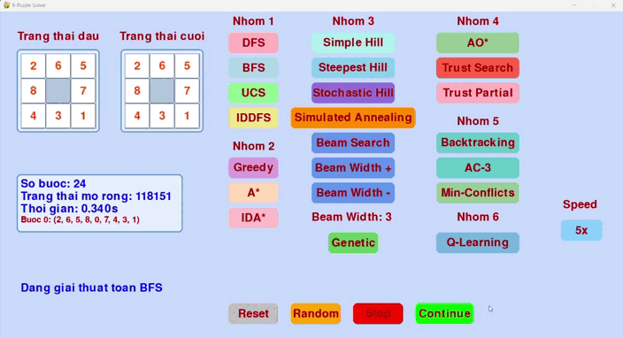

# AI_exercise

# Đồ án cá nhân: 8-Puzzle Solver

## 🎯 Mục tiêu
Xây dựng một chương trình giải bài toán **8-Puzzle** sử dụng nhiều thuật toán tìm kiếm khác nhau trong lĩnh vực Trí tuệ nhân tạo.

---

## 🧠 Các thuật toán được triển khai

| Thuật Toán               | Mô Tả                                                                 | Minh Họa GIF                              |
|--------------------------|----------------------------------------------------------------------|-------------------------------------------|
| **Breadth-First Search (BFS)** | Tìm kiếm theo chiá»u rộng, sử dụng hàng đợi (queue) để khám phá tất cả các trạng thái ở mức hiện tại trước khi chuyển sang mức sâu hơn. Đảm bảo tìm được đường đi ngắn nhất nhưng tốn bộ nhớ khi không gian trạng thái lớn.    |                      |
| **Depth-First Search (DFS)**   | Tìm kiếm theo chiều sâu, sử dụng ngăn xếp (stack) để khám phá nhánh sâu nhất trước khi quay lại. Không đảm bảo đường đi ngắn nhất và có thể dẫn đến vòng lặp nếu không kiểm soát.             |                    |
| **Uniform Cost Search (UCS)**  | Tìm kiếm chi phí đồng nhất, sử dụng hàng đợi ưu tiên (priority queue) để ưu tiên trạng thái có chi phí đường đi từ gốc thấp nhất. Đảm bảo đường đi tối ưu khi chi phí di chuyển giữa các trạng thái bằng nhau.        |                     |
| **Iterative Deepening DFS (IDDFS)** | Kết hợp ưu điểm của DFS và BFS, thực hiện DFS với giới hạn độ sâu tăng dần qua từng vòng lặp. Tiết kiệm bộ nhớ hơn BFS và đảm bảo đường đi ngắn nhất.            |                 |
| **Greedy Best-First Search**   | Tìm kiếm tham lam, sử dụng hàng đợi ưu tiên để chá»n trạng thái có giá trị heuristic (khoảng cách Manhattan) nhá» nhất mà không xét chi phí từ gốc. Nhanh nhưng không đảm bảo tối ưu.          |                |
| **A* Search**                 | Tìm kiếm tối ưu, kết hợp chi phí từ gốc (g) và giá trị heuristic (h = Manhattan + Linear Conflict). Đảm bảo đường đi ngắn nhất nếu heuristic thá»a mãn tính chất đơn điệu (monotonic).       |                 |
| **IDA* Search**               | Biến thể của A*, sử dụng tìm kiếm theo chiá»u sâu với ngưỡng heuristic tăng dần. Tiết kiệm bộ nhớ hơn A* nhưng có thể lặp lại việc khám phá trạng thái.               |                |
| **Simple Hill Climbing**       | Tìm kiếm leo đồi đơn giản, chọn trạng thái láng giềng ngẫu nhiên tốt hơn trạng thái hiện tại dựa trên heuristic (Manhattan + Linear Conflict). Dễ bị kẹt ở cực trị cục bộ.                    |     |
| **Steepest Hill Climbing**     | Tìm kiếm leo đồi dốc nhất, xem xét tất cả trạng thái láng giềng và chọn trạng thái có heuristic tốt nhất. Vẫn có nguy cơ kẹt ở cực trị cục bộ nhưng cải thiện hơn Simple Hill Climbing.    |  |
| **Stochastic Hill Climbing**   | Tìm kiếm leo đồi ngẫu nhiên, chá»n trạng thái láng giá»ng ngẫu nhiên nhưng ưu tiên trạng thái tốt hơn dựa trên xác suất. Giúp thoát khá»i cực trị cục bộ nhá» yếu tố ngẫu nhiên.           |  |
| **Simulated Annealing**        | Mô phỏng ủ nhiệt, chấp nhận cả trạng thái xấu hơn với xác suất giảm dần theo "nhiệt độ". Nhiệt độ giảm theo thời gian (cooling rate), giúp thoát khỏi cực trị cục bộ và tìm giải pháp toàn cục.    |  |
| **Beam Search**                | Tìm kiếm chùm, giữ một số lượng trạng thái giới hạn (beam width) ở mỗi mức, kết hợp giữa BFS và tính tham lam. Có thể bá» sót giải pháp tối ưu nếu beam width nhá».   |      |
| **Beam Search**                | Tìm kiếm chùm, giữ một số lượng trạng thái giới hạn (beam width) ở mỗi mức, kết hợp giữa BFS và tính tham lam. Có thể bá» sót giải pháp tối ưu nếu beam width nhá».   |      |
| **Genetic Algorithm**                | Thuật toán di truyền, sử dụng quần thể các trạng thái, thực hiện các phép lai ghép (crossover) và đột biến (mutation) để tiến hóa đến trạng thái mục tiêu. Phù hợp với không gian trạng thái phức tạp.   |     |
| **AO Search***                | Tìm kiếm AND-OR, xây dựng kế hoạch dựa trên các hành động và kết quả có thể xảy ra. Phù hợp với các bài toán có tính không chắc chắn, sử dụng heuristic để định hướng.   |      |
| **Trust-Based Search**                | Tìm kiếm dựa trên niềm tin, kết hợp heuristic với yếu tố niềm tin (belief factor) dựa trên lịch sử trạng thái. Tăng khả năng ưu tiên các trạng thái gần giải pháp.   |      |
| **Trust-Based Search (Partial)**                | Biến thể của Trust-Based Search, giả định chỉ biết một phần thông tin mục tiêu (ví dụ: hàng đầu tiên). Sử dụng niềm tin và heuristic để định hướng, chuyển sang A* khi đạt mục tiêu cục bộ.   |      |
| **Backtracking CSP**                | Tìm kiếm quay lui dựa trên bài toán thỏa mãn ràng buộc (CSP), gán giá trị cho các ô trên bảng và kiểm tra tính hợp lệ (độ khả thi và khả năng đạt từ trạng thái ban đầu).   |     |

## 👨‍💻 Tác giả

**Nguyễn Trung Hậu**  
MSSV: `23110212`  
Môn: `Trí Tuệ Nhân Tạo`  
Giáo viên hướng dẫn: `Phan Thị Huyền Trang` 
